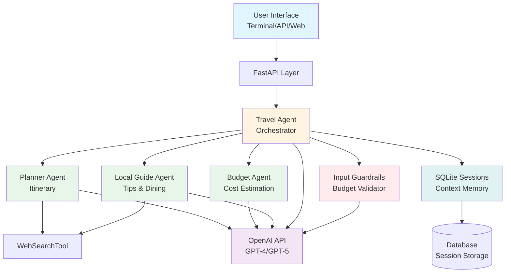
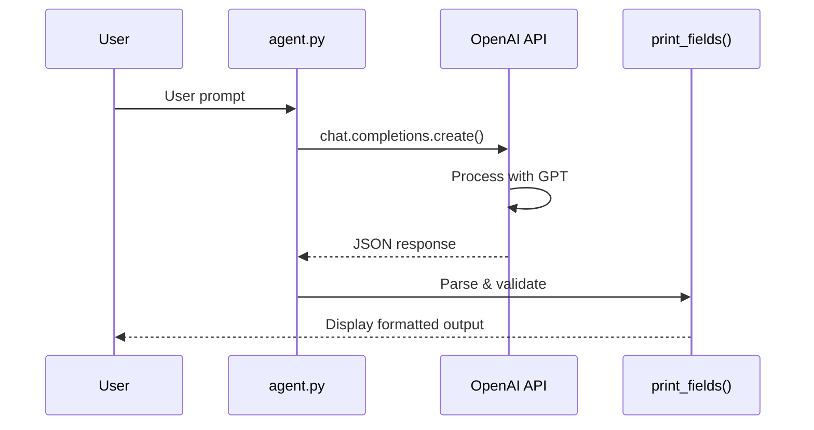
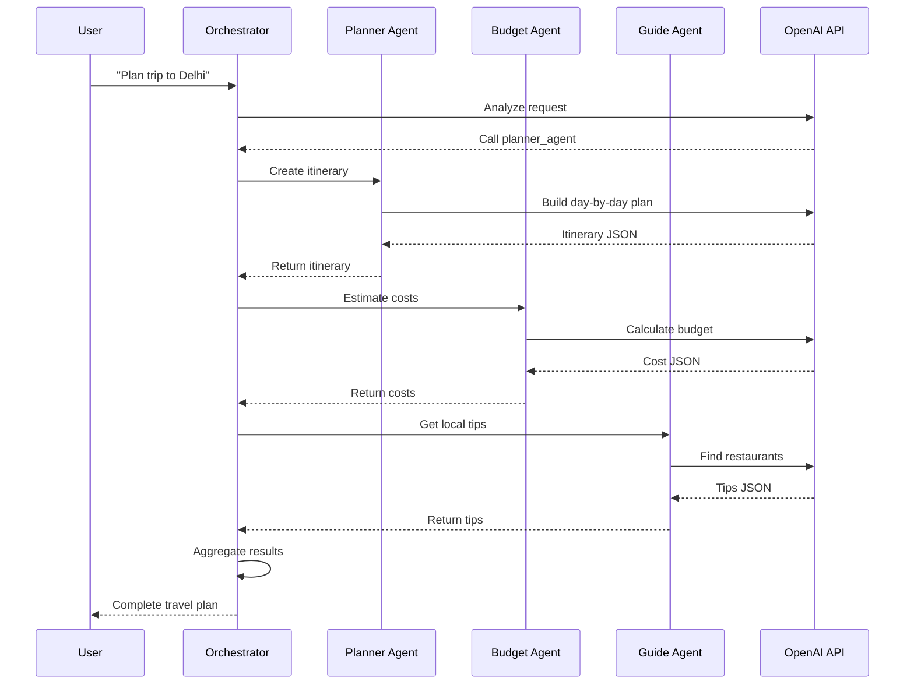
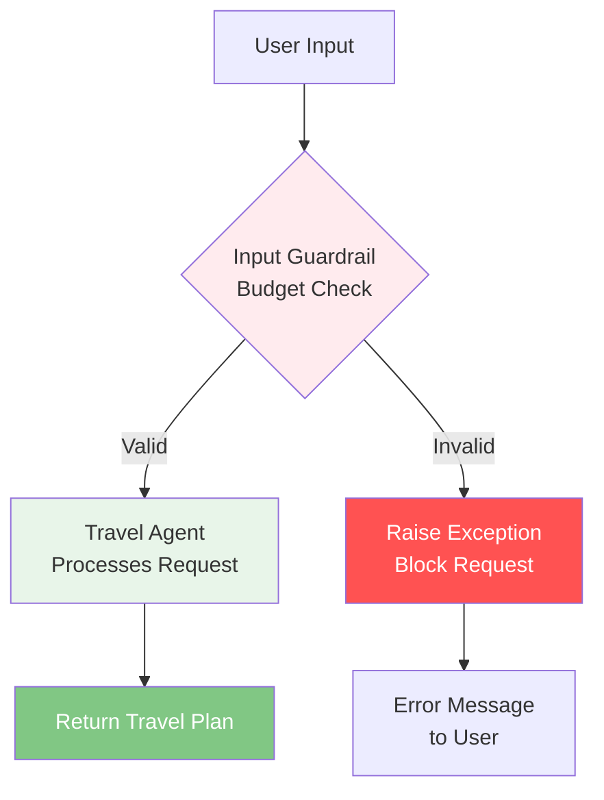
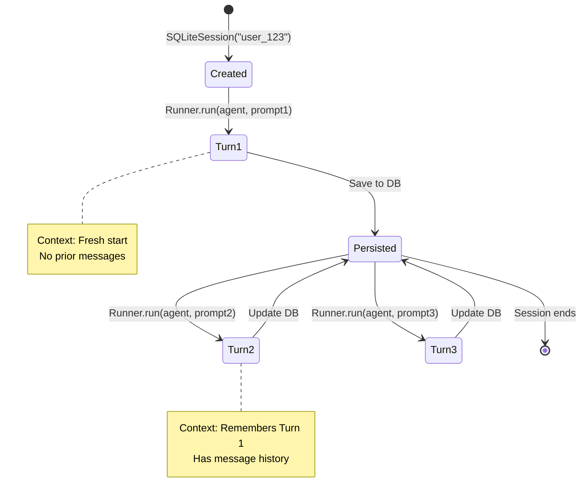
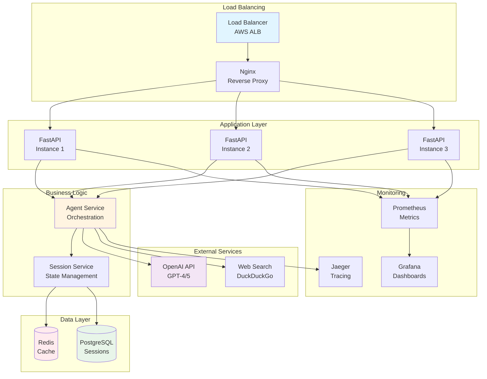
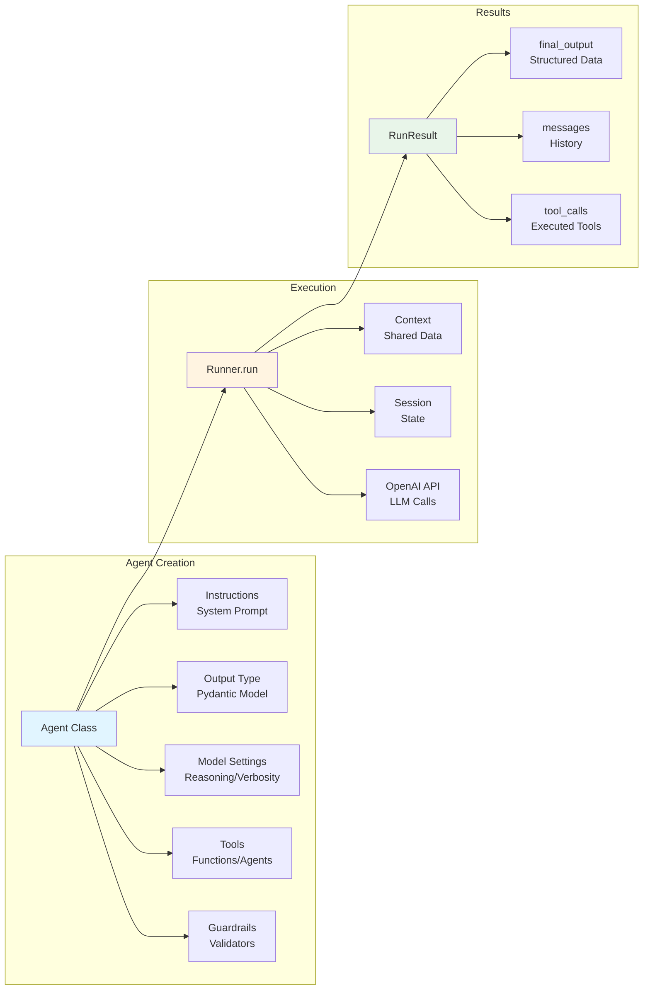
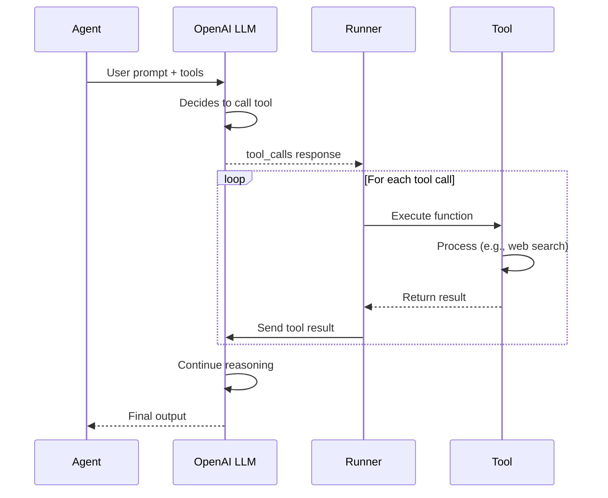

# Architecture Diagrams

Visual representations of the OpenAI Agents SDK Travel Planning System architecture.

---

## System Architecture Diagram

---

## Data Flow - Lesson 1 (Basic Agent)

---

## Data Flow - Lesson 3 (Multi-Agent Orchestration)

---

## Guardrail Flow - Lesson 4

---

## Session Lifecycle - Lesson 5

---

## Production Architecture

---

## Component Interaction

---

## Tool Execution Flow

---

These diagrams are created using Mermaid syntax and can be:
- Rendered in GitHub, VS Code (with Mermaid extension), or documentation sites
- Exported as PNG/SVG for presentations
- Updated as architecture evolves

To render locally:
1. Install VS Code Mermaid extension
2. Preview Markdown files
3. Or use online editor: [mermaid.live](https://mermaid.live)
